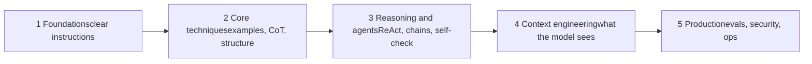
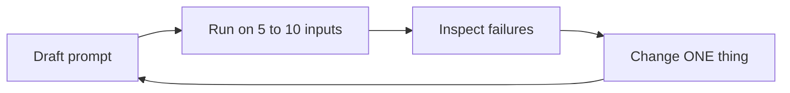
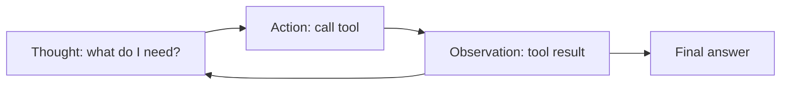
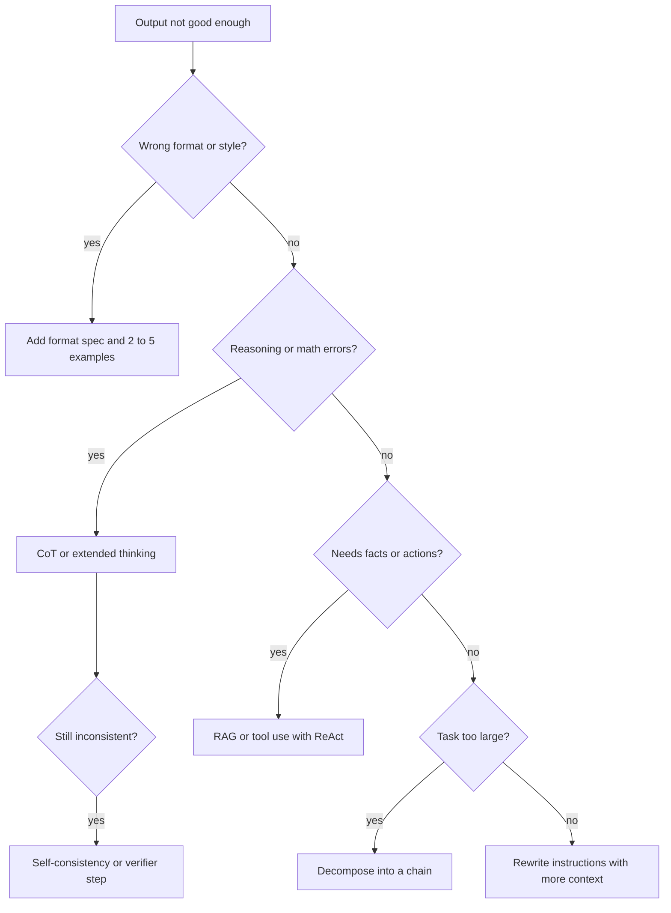
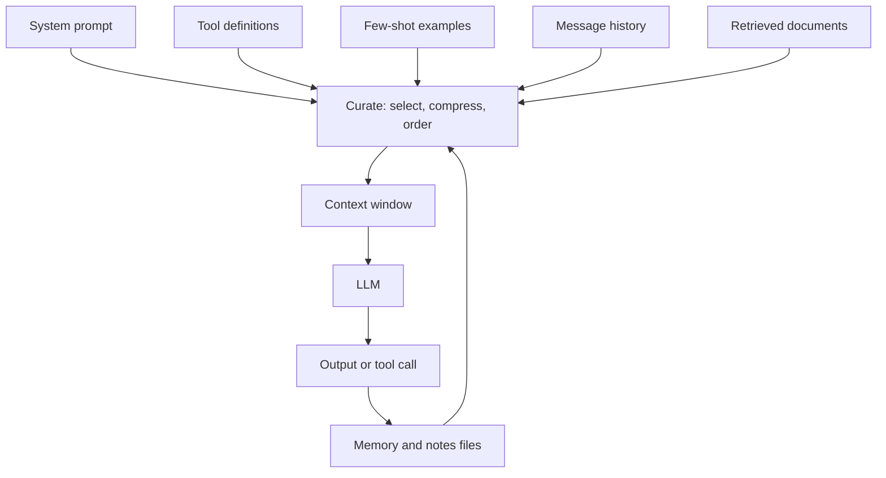
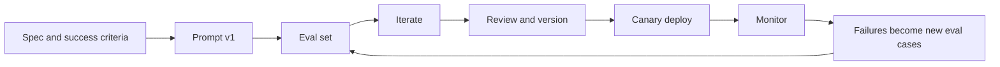
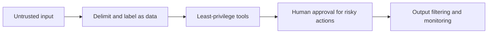

[1 Foundations](#l1) [2 Core techniques](#l2) [3 Reasoning and agents](#l3) [4 Context engineering](#l4) [5 Production](#l5) [Cheat sheet and sources](#end)

# Prompt engineering, from first prompt to production

Five levels. Each builds on the last: write clearly, use proven techniques, add reasoning and tools, curate context, then ship and maintain prompts like software.



## 1 Foundations (beginner)

### What an LLM does with your prompt

A model reads your text as **tokens** and predicts the next token, one at a time. It has no hidden knowledge of what you meant: everything it can use is in the prompt (plus its training). So prompt quality is mostly **information quality**. `temperature` controls randomness: low (0 to 0.3) for extraction and classification, higher for brainstorming.

### Anatomy of a good prompt

**Role**: who the model should act as (sets vocabulary and standards).

**Context**: background, audience, why the task exists.

**Task**: one clear instruction stated as an action.

**Constraints**: length, tone, must and must-not rules.

**Output format**: JSON, table, bullets, headings.

**Examples** and the **input data**, clearly delimited.

### The five habits of beginners who improve fast

- **Be clear and direct.** Imagine briefing a smart new colleague with zero context. If they would need to ask a question, answer it in the prompt.
- **Say what to do, not only what to avoid.** "Write in flowing prose" beats "don't use bullets".
- **Separate instructions from data** with delimiters (XML-style tags or triple quotes) so pasted text is never mistaken for instructions.
- **Specify the output format** and show its shape.
- **Iterate.** Prompting is a loop: draft, run, inspect failures, adjust one thing, repeat.

```
Weak:   Summarize this.

Strong: You are an analyst writing for busy executives.
        Summarize the report in the tags below in 5 bullets,
        each under 20 words, ending with one risk.
        <report> ...text... </report>
```



## 2 Core techniques (intermediate)

### Zero-shot, one-shot, few-shot

**Zero-shot**: instructions only. **Few-shot** (in-context learning, popularised by the GPT-3 paper): add 2 to 5 input/output examples. Examples teach format, tone and edge cases faster than prose. Make them **diverse**, include at least one hard case, and keep them consistent, because models copy patterns, including accidental ones.

### Chain-of-thought (CoT)

Asking the model to reason step by step before answering improves math, logic and multi-step tasks (Wei et al., 2022). A bare "Let's think step by step" already helps (Kojima et al., 2022). Put reasoning in a separate section so you can parse the final answer.

```
Think through the problem in <thinking> tags, then give
only the final answer in <answer> tags.
```

**Note.** Dedicated reasoning models and extended-thinking modes already reason internally. Give them the goal and constraints, not micro-managed steps, and test whether explicit CoT still adds value.

### Structure and output control

- **XML or JSON delimiters** make prompts unambiguous and outputs parseable.
- **Prefilling** or starting the answer for the model (for example an opening `{`) locks the format where the API supports it.
- **Schema-constrained output** (structured outputs, function calling) beats "please return valid JSON" for anything a program reads.
- **Give an escape hatch**: "If the answer is not in the text, reply UNKNOWN." This cuts hallucination.

### Roles and system prompts

The system prompt holds durable behaviour (role, rules, tone, format). The user message holds the task. A precise role ("senior tax accountant reviewing for audit risk") shifts depth and style; a vague one adds nothing.

## 3 Reasoning, decomposition and agents (advanced)

The Prompt Report (Schulhoff et al., 2024) surveyed 1,500+ papers and catalogued 58 text prompting techniques in six families. Use the family as a map:

| Family                | Idea                      | Examples                                  |
| --------------------- | ------------------------- | ----------------------------------------- |
| Few-shot / in-context | Teach by demonstration    | Example selection, ordering               |
| Thought generation    | Make reasoning explicit   | CoT, zero-shot CoT, Thread-of-Thought     |
| Zero-shot             | Precise instructions only | Role, re-reading, style prompts           |
| Ensembling            | Many attempts, combine    | Self-consistency, mixture of prompts      |
| Self-criticism        | Model checks itself       | Self-Refine, Reflexion, verification      |
| Decomposition         | Split the problem         | Least-to-Most, Tree of Thoughts, chaining |

### Techniques in depth

- **Self-consistency** (Wang et al., 2022): sample several reasoning paths at higher temperature, take the majority answer. Costs N times more; use where accuracy matters more than price.
- **Tree of Thoughts** (Yao et al., 2023): explore and score multiple partial solutions, backtrack on dead ends. For puzzles, planning, search-like problems.
- **Least-to-Most / decomposition**: solve easy sub-questions first, feed answers forward.
- **Self-Refine and Reflexion**: generate, critique against explicit criteria, revise. Critique with a rubric, not "make it better".
- **ReAct** (Yao et al., 2022): interleave reasoning with tool calls so answers are grounded in observations.
- **Prompt chaining**: one focused prompt per step, validating between steps. Easier to debug than one giant prompt.
- **Meta-prompting**: have a model draft or improve prompts, then judge the result on your evals, never by eye alone.




### Which technique when? (decision flow)



**Surprising fact.** Prompts are fragile. The Prompt Report notes that small changes, even duplicated text or different names, can change results. Never trust a prompt you have not measured.

## 4 Context engineering (senior)

Anthropic frames context engineering as the natural progression of prompt engineering: the question shifts from "what words?" to "what configuration of tokens is most likely to produce the behaviour I want?" Context includes the system prompt, tools, examples, message history and retrieved data, and it is a **finite attention budget**. More is not better.



### Senior-level principles

- **Right altitude.** System prompts should not be brittle if-else scripts, nor vague slogans. State goals, principles and a few canonical examples.
- **Smallest set of high-signal tokens.** Delete redundant rules. Every line competes for attention.
- **Position matters.** "Lost in the middle" research (Liu et al.) shows models use information at the start and end of long contexts better than the middle. Put long documents first, instructions and the question last, and restate critical rules at the end.
- **Tools are prompts.** Clear names, non-overlapping purposes, unambiguous parameters, and token-efficient outputs. If a human cannot tell which tool to use, neither can the model.
- **Just-in-time retrieval.** Keep identifiers and fetch details when needed rather than preloading everything (RAG, file reads, search).
- **Long-horizon tasks.** Use compaction (summarise history), structured note-taking to external memory, and sub-agents with clean contexts.
- **Explain the why.** A rule with its reason generalises better than a bare rule.
- **Model-specific tuning.** Techniques transfer, details do not. Re-run evals on every model upgrade.

| Symptom                | Likely cause                                       | Fix                                     |
| ---------------------- | -------------------------------------------------- | --------------------------------------- |
| Ignores an instruction | Buried mid-context, or conflicts with another rule | Move to end, dedupe, resolve conflicts  |
| Hallucinated facts     | No grounding, no escape hatch                      | RAG, quote-then-answer, allow "unknown" |
| Drifts over long chats | Context rot, stale history                         | Compaction, notes, restart with summary |
| Wrong tool chosen      | Overlapping tool descriptions                      | Merge or sharpen tools, add examples    |
| Inconsistent format    | Format only described                              | Examples or schema-constrained output   |

## 5 Production practices

### Treat prompts as code

- **Version control** prompts, templates and model IDs together; pin model versions and review changes in pull requests.
- **Template** with clear variable slots; never string-concatenate untrusted text into instructions.
- **Write the spec first**: inputs, outputs, success criteria, failure modes, cost and latency targets.



### Evals: the core discipline

- Build a **golden set** (start with 30 to 100 real cases, including edge cases and adversarial ones). Add every production failure.
- Score with **code checks** first (schema, regex, exact match), then **LLM-as-judge** with a rubric, then sampled human review. Calibrate the judge against humans.
- Run evals on every prompt, model or retrieval change to catch **regressions**. Compare against the current version, not against nothing.
- Track quality, refusal rate, format-valid rate, latency and cost per request.

### Reliability and cost

- **Validate outputs** against a schema; retry with the error message, then fall back (simpler prompt, other model, human).
- **Prompt caching**: keep stable content (system prompt, tools, documents) at the front and variable content last.
- **Route by difficulty**: small model for easy cases, larger for hard ones. Use batch APIs for offline work.
- **Set timeouts, token limits and rate-limit handling**; stream when latency is user-facing.
- **Log** prompts, versions, outputs, tool calls and feedback (redact personal data).

### Security: prompt injection

Injection (OWASP's top LLM risk) happens when untrusted text, such as a web page, email or file, contains instructions the model obeys. There is no single fix; layer defences.



- Tell the model that content inside data tags is never to be followed as instructions, but do not rely on that alone.
- Give tools only the permissions the task needs; require confirmation for sends, deletes and payments.
- Never place secrets in prompts. Red-team with known jailbreak and injection suites before launch.

### Pre-launch checklist

- Spec, golden set and pass thresholds agreed
- Prompt and model versions pinned and reviewable
- Output schema validation plus fallback path
- Injection tests run, tool permissions minimised
- Cost and latency measured at expected traffic
- Logging, alerts and a rollback plan in place

## Cheat sheet, mistakes and sources

| Common mistake                          | Do this instead                           |
| --------------------------------------- | ----------------------------------------- |
| Vague task, hoping the model guesses    | State audience, goal, format, constraints |
| Long list of "don'ts"                   | Positive instructions with reasons        |
| Judging a prompt on one example         | Measure on a varied eval set              |
| Giant prompt for a big task             | Chain focused steps with validation       |
| Copying prompts across models unchanged | Re-evaluate per model                     |
| Preloading all context                  | Curate and retrieve just in time          |

### Sources these notes draw on

- Schulhoff et al., _The Prompt Report: A Systematic Survey of Prompting Techniques_ (arXiv 2406.06608)
- Anthropic Engineering, _Effective context engineering for AI agents_; Anthropic prompt engineering docs and interactive tutorial
- Brown et al. 2020 (few-shot); Wei et al. 2022 (CoT); Kojima et al. 2022 (zero-shot CoT); Wang et al. 2022 (self-consistency); Yao et al. 2022 (ReAct) and 2023 (Tree of Thoughts); Liu et al. (Lost in the Middle)
- OWASP Top 10 for LLM Applications; DeepLearning.AI prompt engineering course
